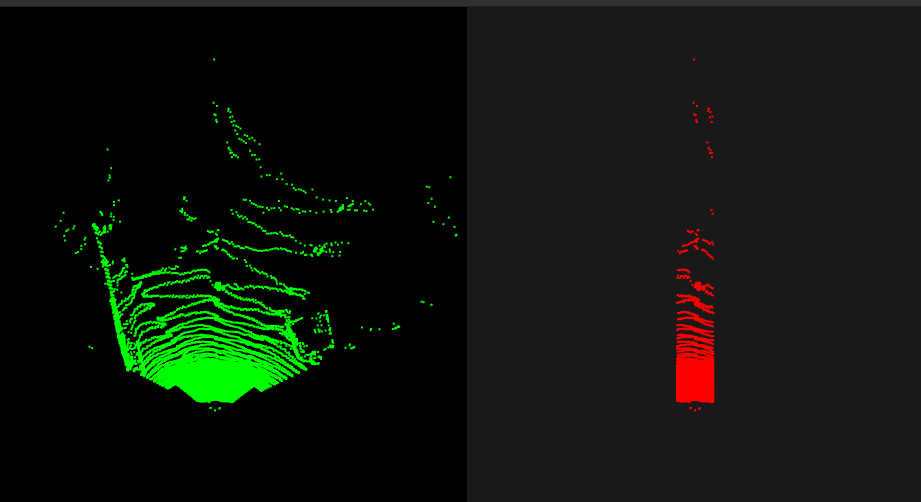
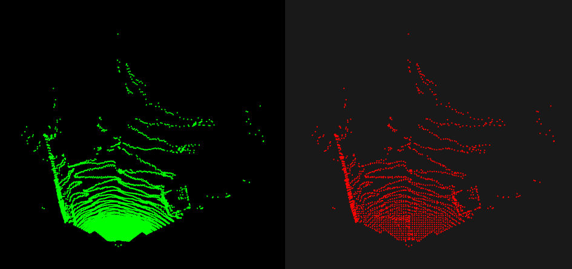
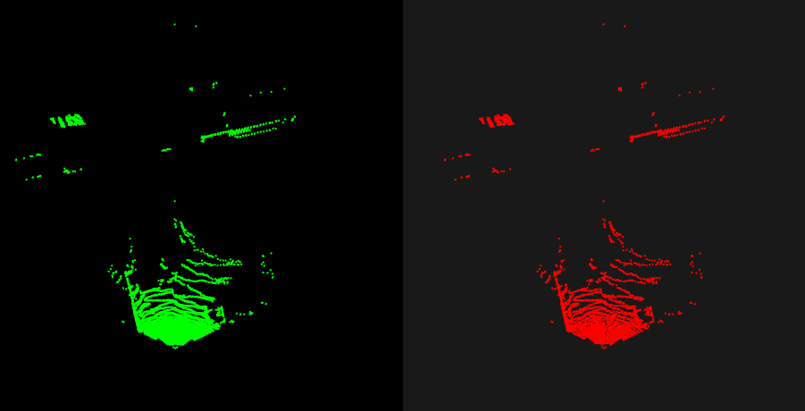
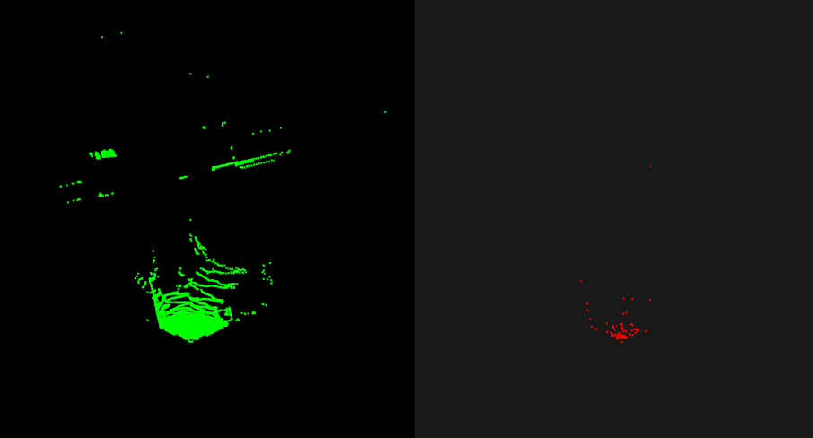

<!--
 * @Author: tyz 1872516355@qq.com
 * @Date: 2026-04-15 20:54:04
 * @LastEditors: tyz 1872516355@qq.com
 * @LastEditTime: 2026-04-15 21:08:20
 * @FilePath: /Desktop/点云降采样/README.md
 * @Description: 这是默认设置,请设置`customMade`, 打开koroFileHeader查看配置 进行设置: https://github.com/OBKoro1/koro1FileHeader/wiki/%E9%85%8D%E7%BD%AE
-->
# 功能
## 1.点云降采样：均匀降采样、体素降采样、随机降采样、直通滤波
## 2.点云可视化
# 编译
## 1.mkdir build && cd build
## 2.cmake ..
## 3.make
# 运行
## ./downsamplePC

## 直通滤波降采样效果

## 体素降采样效果

## 均匀降采样效果

## 随机降采样效果
